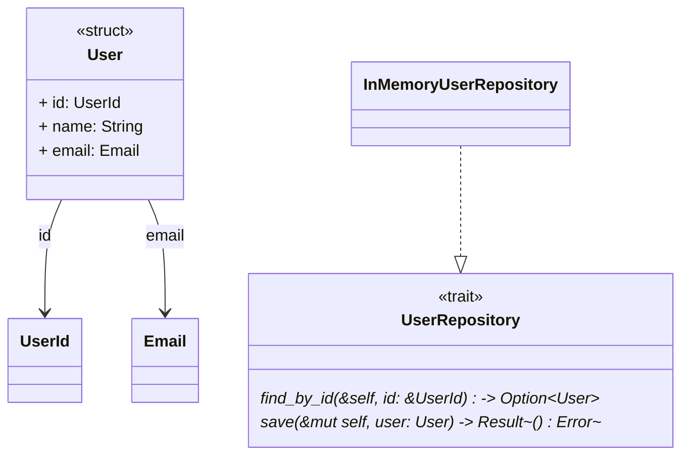
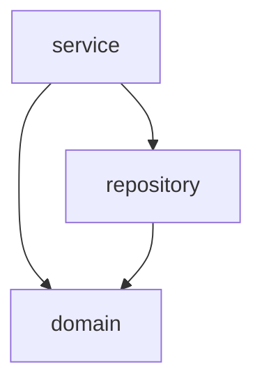

# rust-arch-visualizer

A CLI tool to visualize Rust architecture as Mermaid diagrams. Analyzes Rust codebases and generates diagrams showing traits, structs, enums, modules, and their relationships.

## Features

- **Class Diagram**: Visualize structs, enums, traits with their fields/variants/methods
- **Module Dependencies**: Show module hierarchy and use relationships
- **Function Call Graph**: Display function call relationships
- **Trait Implementation**: Show which types implement which traits
- **Field References**: Detect struct/enum field type relationships

## Installation

```bash
cargo install --path .
```

## Usage

### Analyze a Crate

```bash
# Analyze current directory
rust-arch analyze

# Analyze specific crate
rust-arch analyze /path/to/crate

# Output to file
rust-arch analyze -o architecture.md

# Generate only class diagram
rust-arch analyze -d class

# Output raw Mermaid (without markdown wrapper)
rust-arch analyze -d class --raw

# Output as JSON for further processing
rust-arch analyze --json
```

### Analyze a Single File

```bash
rust-arch file src/main.rs
rust-arch file src/lib.rs -o diagram.md
```

### Diagram Types

| Type | Description |
|------|-------------|
| `class` | Class diagram showing structs, enums, traits and relationships |
| `module` | Module dependency flowchart |
| `call-graph` | Function call graph |
| `full` | All diagrams combined (default) |

## Example Output

### Class Diagram



### Module Dependencies



## Supported Rust Constructs

- Structs (named fields, tuple structs, unit structs)
- Enums (with variants and fields)
- Traits (with method signatures)
- Impl blocks (inherent and trait implementations)
- Functions (with call relationships)
- Modules (inline and file-based)
- Use statements (for dependency tracking)
- Generics and visibility modifiers

## Limitations

- Does not track ownership/lifetime relationships
- Method calls within impl blocks are simplified
- External crate types shown as-is (not resolved)
- Macro-generated code not analyzed

## License

MIT
