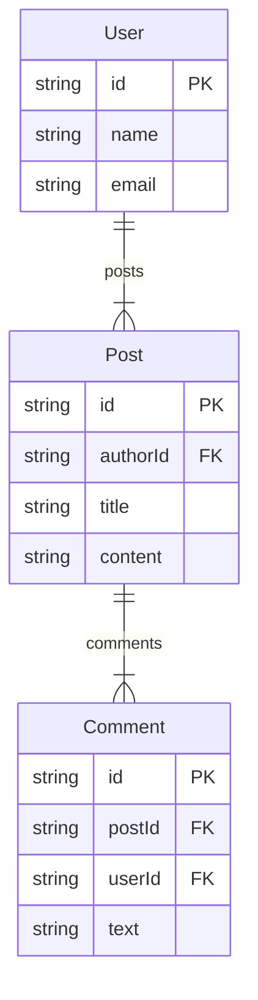

# ts-er-generator

TypeScript の interface/type 定義から Mermaid erDiagram 形式の ER 図を自動生成するツール。

## 特徴

- TypeScript の interface/type 定義を解析して ER 図を生成
- Mermaid erDiagram 形式で出力
- CLI と Web UI の両方に対応
- ファイル監視によるライブリロード機能
- JSDoc タグ (`@pk`, `@fk`, `@unique`) による主キー/外部キー指定
- **Bun でビルド不要で直接実行可能**

## クイックスタート

Bun がインストールされていれば、ビルド不要でそのまま実行できます。

```bash
# リポジトリをクローン
git clone https://github.com/your-repo/ts-er-generator.git
cd ts-er-generator

# 依存関係をインストール
bun install

# ER図を生成
bun src/cli/index.ts generate "src/**/*.ts"

# または shebang で直接実行
./src/cli/index.ts generate "src/**/*.ts"
```

## 使い方

### generate コマンド

TypeScript ファイルから Mermaid 形式の ER 図を生成します。

```bash
# 基本的な使い方
bun src/cli/index.ts generate "src/models/**/*.ts"

# ファイルに出力
bun src/cli/index.ts generate "src/models/**/*.ts" --output diagram.mmd

# オプション
bun src/cli/index.ts generate "src/**/*.ts" --no-properties  # プロパティを非表示
bun src/cli/index.ts generate "src/**/*.ts" --comments       # JSDoc コメントを表示
bun src/cli/index.ts generate "src/**/*.ts" --no-keys        # PK/FK マーカーを非表示
```

### preview コマンド

ブラウザでライブプレビューを開きます。ファイルを変更すると自動的に図が更新されます。

```bash
# 基本的な使い方
bun src/cli/index.ts preview "src/models/**/*.ts"

# ポートを指定
bun src/cli/index.ts preview "src/models/**/*.ts" --port 8080

# ブラウザを自動で開かない
bun src/cli/index.ts preview "src/models/**/*.ts" --no-open
```

### Web UI

ブラウザ上で TypeScript コードを入力し、リアルタイムで ER 図をプレビューできます。

```bash
bun run dev:web
```

http://localhost:5173 でアクセスできます。

## 入力例

```typescript
/**
 * ユーザーエンティティ
 */
interface User {
  /** @pk */
  id: string;
  name: string;
  email: string;
  posts: Post[];
}

/**
 * ブログ記事
 */
interface Post {
  /** @pk */
  id: string;
  /** @fk */
  authorId: string;
  title: string;
  content: string;
  comments: Comment[];
}

/**
 * コメント
 */
interface Comment {
  /** @pk */
  id: string;
  /** @fk */
  postId: string;
  /** @fk */
  userId: string;
  text: string;
}
```

## 出力例



## サンプル

`examples/todo-domain/` に DDD スタイルのサンプルコードがあります。

```bash
# サンプルから ER 図を生成
bun src/cli/index.ts generate "examples/todo-domain/entities/*.ts"
```

## 対応する型

### 基本型

- `string`, `number`, `boolean`, `bigint`, `symbol`
- `null`, `undefined`, `void`, `never`, `any`, `unknown`

### 複合型

- 配列: `string[]`, `Array<T>`
- オプショナル: `name?: string`, `string | null`
- ユニオン: `'draft' | 'published' | 'archived'`
- ジェネリクス: `Map<K, V>`, `Record<string, T>`

### 関係性

- 1対1: `profile: Profile`
- 1対多: `posts: Post[]`
- 0または1: `profile?: Profile`
- 0以上: `comments?: Comment[]`

## JSDoc タグ

| タグ | 説明 |
|------|------|
| `@pk` または `@primaryKey` | 主キー |
| `@fk` または `@foreignKey` | 外部キー |
| `@unique` | ユニークキー |

## 開発

```bash
# 依存関係のインストール
bun install

# Web UI の開発サーバー起動
bun run dev:web

# テスト実行
bun run test

# テスト (1回のみ)
bun run test:run
```

## ライセンス

MIT
